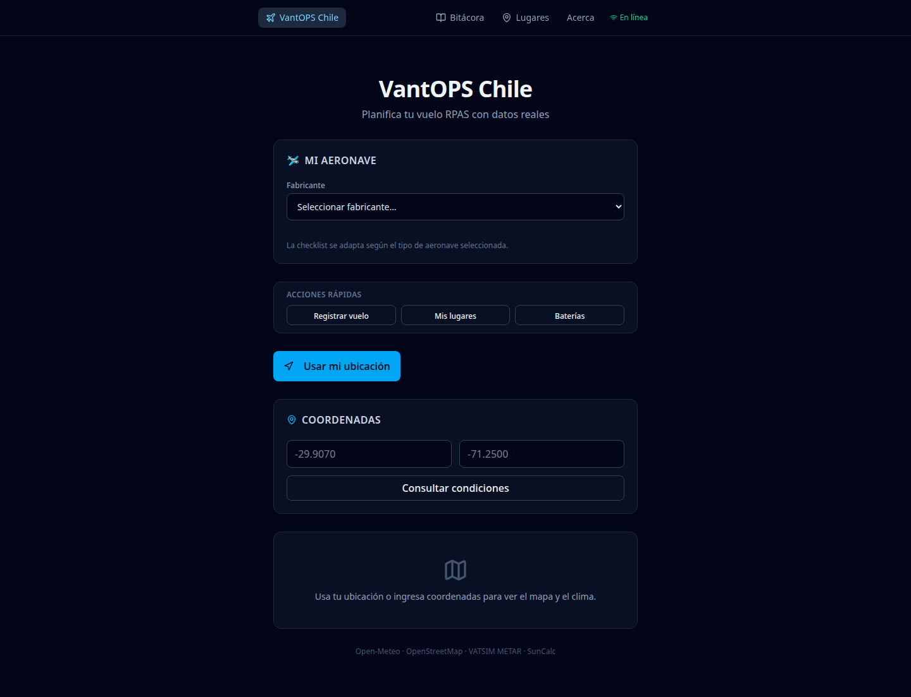

# VantOPS Chile

PWA gratuita de planificación y apoyo a operaciones RPAS en Chile. Datos reales, privacidad por defecto, sin login obligatorio.

**Versión:** v0.9.0 · **Live:** [2674321.github.io/vantops-chile](https://2674321.github.io/vantops-chile/)

## Capturas



## Stack

- React 19 + TypeScript
- Vite 6
- Tailwind CSS v4
- shadcn/ui (componentes button, card)
- TanStack Query
- Leaflet + react-leaflet (OpenStreetMap)
- Open-Meteo (clima + elevación)
- SunCalc (posición solar local)
- VATSIM METAR (observaciones)
- vite-plugin-pwa (service worker + manifest, workbox)
- Persistencia local: localStorage + IndexedDB (Dexie)
- Biome (lint)
- Vitest (tests)
- GitHub Actions + GitHub Pages

## Ejecutar localmente

```bash
npm install
npm run dev
```

## Tests

```bash
npm test                 # suite unitaria e integración local (sin red)
npm run test:integration # incluye pruebas contra APIs reales (RUN_INTEGRATION=1)
```

## Build de producción

```bash
npm run build
```

> En Node 18, el build usa `--experimental-global-webcrypto` automáticamente.

## Estructura

```
src/
  app/          App.tsx, ErrorBoundary
  domain/       Modelos: weather, elevation, solar, observation, sourceMeta, coordinate, operationZone, pwaInstall
  domain/assessment/  FlightAssessment, FlightLimits, rules, evaluator, hourly, operationWindow, aircraft (catalog)
  domain/checklist/   ChecklistItem, ChecklistState, engine, defaultChecklist
  providers/
    weather/        Open-Meteo forecast (actual + horario)
    elevation/      Open-Meteo Elevation API
    solar/          SunCalc (cálculo local)
    observations/   VATSIM METAR, decoder, estaciones
    geocoding/      Nominatim (búsqueda de ubicación, OSM)
  features/
    dashboard/      Pantalla principal, LocationSearch, OperationZoneControl
    settings/       Ajustes (límites del piloto)
    aircraft/       Selector de aeronave (fabricante → modelo → tipo)
    assessment/     AssessmentCard, OperationWindowCard (ventana estimada)
    checklist/      CheckListCard (checklist prevuelo)
    logbook/        Bitácora, baterías, exportar/importar (JSON + CSV)
    places/         Lugares guardados
    pwa/            InstallPromptCard
    map/            Leaflet + OSM + círculo de zona (lazy)
    weather/        WeatherPanel, WeatherTimeline
    elevation/      ElevationCard
    solar/          SolarCard
    observations/   NearbyMetarCard
  hooks/          useLastCoordinate, useOnlineStatus, useInstallPrompt
  storage/        Dexie/IndexedDB (db.ts, export.ts, csvExport.ts, repositories/), settings.ts, checklists.ts
  lib/            download.ts (descargas de cliente)
  i18n/           es-CL
  components/     ui/ (button, card)
  test/           fixtures compartidos de tests
references/       normativa-dgac/ (material de desarrollo, no normativa runtime)
```

## Flujo de datos

```
UI (features/)
  → Provider adapter (providers/)
    → External API (Open-Meteo, VATSIM METAR, Nominatim/OSM, SunCalc)
  → Domain model (domain/)
  → DataSourceMeta (status, timestamps, fuente)
```

La UI nunca depende del JSON crudo de APIs externas.

## Fase 0 (completada)

- React 19 + Vite + TS + Tailwind
- Dashboard con GPS o coordenadas manuales
- Clima real vía Open-Meteo (viento 10m/100m, ráfagas, dirección, temperatura, precipitación, humedad, visibilidad, nubosidad)
- ErrorBoundary global
- HashRouter (sin 404 al recargar)
- CI + Deploy automático

## Fase 1 (completada)

- **Mapa Leaflet/OSM** con marcador, clic para seleccionar punto, OpenStreetMap attribution
- **Elevación** vía Open-Meteo Elevation API
- **Sol** calculado localmente con SunCalc (amanecer, atardecer, hora dorada, duración del día)
- **METAR cercano** vía VATSIM (parser decode: viento, visibilidad, QNH, nubosidad, fenómenos, temperatura/punto de rocío)
- **11 aeródromos chilenos** con cálculo de estación más cercana (haversine)
- **Metadata de fuentes**: timestamp requestedAt/receivedAt, status (actualizado/antiguo/error/sin datos), nombre de fuente
- **PWA**: manifest, service worker, íconos 192/512, instalable
- **Provider architecture**: domain → provider → API con normalización

## Fase 2 (completada)

- **Motor de evaluación de vuelo**: reglas basadas en límites configurables (viento, ráfagas, precipitación, visibilidad, temperatura)
- **AssessmentCard**: semáforo FAVORABLE / CAUTION / UNFAVORABLE / NO_DATA con razones detalladas
- **FlightLimits**: modelo de configuración de límites persistidos en localStorage
- **AircraftProfile**: modelo de perfil de aeronave (preparado para futuras reglas por tipo)
- **Storage abstraction**: `storage/settings.ts` con separación de concerns para futura migración a IndexedDB/Dexie
- **Consolidación de Coordinate**: validación, serialización, formato con tests de regresión de signo negativo
- **80 tests** pasando (coordinate, assessment, weather, elevation, solar, METAR, stations, sourceMeta)

## Fase 3 — R0.4 Checklist (completada)

- **Checklist prevuelo interactiva**: 39 items en 9 categorías (Normativa, Documentación, Aeronave, Batería, Entorno, Clima, Operación, Seguridad, Post-vuelo)
- **Checklist engine**: funciones puras para progreso, visibilidad, contexto, toggle, reset
- **Items contextuales**: se muestran automáticamente según condiciones (lluvia, viento fuerte, baja visibilidad, operación nocturna, zona poblada)
- **Items por tipo de aeronave**: multirrotor, ala fija, VTOL, helicóptero — items específicos se filtran automáticamente
- **ChecklistApplicability**: modelo de aplicabilidad por tipo de aeronave
- **Integración con Assessment**: el estado del assessment alimenta el contexto del checklist (warnings → items destacados)
- **Priorización visual**: items de alerta aparecen destacados en la sección "Revisiones importantes"
- **Persistencia**: estado del checklist guardado en localStorage, sobrevive recarga de página
- **Reset con confirmación**: permite reiniciar sin afectar aeronave, límites ni ubicación
- **Progreso visual**: barra de progreso + porcentaje + indicadores de obligatorios restantes
- **Funcionamiento offline**: checklist opera sin conexión, sin depender de APIs externas
- **Referencias normativas DGAC**: `references/normativa-dgac/` con README e INDEX para desarrollo
- **About page**: sección "Normativa y fuentes oficiales" con enlace a DGAC
- **150 tests** pasando (+26 nuevos: applicability 6, assessment-context 4, aircraft-type 6, warning 2, settings 9)

## R0.4.1 — Regulatory Hardening + Aircraft Selector (completada)

- **ChecklistItem.kind**: distinción REGULATORY / OPERATIONAL / GOOD_PRACTICE en modelo de datos
- **RegulatoryReference**: metadata estructurada (documento, sección, edición, URL fuente, estado verificación)
- **Referencias por item**: items normativos incluyen enlace a fuente oficial DGAC con expansión en UI
- **Corrección de afirmaciones absolutas**: eliminada referencia universal a "400 ft AGL", METAR contextualizado como "revisar información meteorológica disponible"
- **DAN 91 Ed. 4 / ENM 5 (JUL 2023)** y **DAN 151 Ed. 3 (MAY 2024)** como fuentes verificadas
- **Selector de aeronave**: fabricante → modelo → tipo con 8 fabricantes y 30+ modelos
- **Base de aeronaves**: DJI (13 modelos), Autel (3), Skydio (2), Parrot (2), SenseFly (1), Wingtra (1), Quantum Systems (1), Genérico (5)
- **Modo genérico**: 5 perfiles genéricos para aeronaves no catalogadas
- **Estado "modelo no disponible"**: fallback a perfil genérico con mensaje informativo
- **Persistencia**: manufacturer, model, activeAircraft en localStorage
- **applyAircraftLimits integrado**: límites del perfil de aeronave se fusionan con límites personales en assessment
- **Dashboard refresh**: aircraft state se actualiza al cambiar selección sin recargar página
- **About page actualizada**: disclaimer sobre finalidad informativa de referencias
- **171 tests** pasando (+21 nuevos: aircraft catalog 6, createAircraftProfile 3, applyAircraftLimits 3, AIRCRAFT_TYPE_LABELS 1, regulatory references 3, checklist kind 1, storage manufacturer/model 4)

## R0.4.2 — UX Checklist + Referencias Contextuales (completada)

- Mejoras de usabilidad del checklist prevuelo y referencias normativas contextuales.

## R0.5.0 — Logbook + IndexedDB/Dexie (completada)

- **Bitácora de vuelos** con registro local (fecha, duración, aeronave, notas) persistida en IndexedDB vía Dexie.
- **Módulo de baterías**: registro y seguimiento de packs de baterías con conteo de ciclos.
- **Migración y versionado de datos** locales con tests.
- **Export/Import** de la bitácora (JSON) para respaldo y transferencia entre dispositivos.
- Dashboard y páginas de bitácora, detalle de vuelo y baterías.

## R0.6.0 — PWA/Offline + Saved Places + Hardening (completada)

- **PWA instalable** con soporte offline real: service worker y runtime caching (NetworkFirst, TTL 10 min) para Open-Meteo y VATSIM METAR.
- **Lugares guardados**: selección y persistencia de lugares frecuentes en el mapa.
- **Indicador online/offline** en la app.
- **Hardening** de error handling, límites de evaluación y consistencia de datos.

## R0.7.0 — MVP Closure / Settings / Data Integrity / Location Search (completada)

- **Ajustes** (`/ajustes`): preferencias del piloto con límites de viento, ráfaga, precipitación, visibilidad y temperatura; campo vacío = no configurado
- **Límites reales aplicados**: el panel combina los límites del piloto con el perfil de aeronave (`applyAircraftLimits`) — corrige la evaluación que antes ignoraba la configuración
- **Búsqueda de ubicación por nombre** con Nominatim (OSM): solo por acción explícita, caché, máximo 1 req/segundo, timeout, atribución visible; se mantienen GPS, coordenadas manuales y clic en mapa
- **Integridad del respaldo**: backup v1 con formato/versión, validación profunda (`inspectBackup`) y **restauración de configuración** en lista blanca
- **Importación transaccional** en IndexedDB con resolución de conflictos por `updatedAt`; ningún respaldo inválido deja cambios parciales
- **Errores de geolocalización diferenciados** (permiso denegado / no disponible / timeout)
- **Provider de observaciones renombrado** a `vatsimObservation` (la fuente real es `metar.vatsim.net`)
- **Code-splitting**: rutas secundarias y Leaflet bajo demanda; bundle principal de ~653 kB → ~285 kB
- **Navegación responsive** (320–390 px) con pestañas desplazables
- **259 tests** pasando (+88: assessment 9, export/validación 11, integración IndexedDB 8, geocodificación 11, VATSIM 8, settings 3, y base previa)

## R0.8.0 — Flight Planning Core / Weather Timeline / Reliability (completada)

- **Zona de planificación**: dominio `OperationZone` (centro + radio) con presets 500 m / 1 km / 2 km y radio personalizado; rango técnico 50 m–50 km (no es un límite legal)
- **Círculo en el mapa** (`react-leaflet` `Circle`) sincronizado con el radio; el centro sigue siendo la única fuente `lastCoordinate`
- **Pronóstico horario ampliado**: temperatura, humedad, precipitación, código, viento 10 m/100 m, ráfagas, dirección, visibilidad y nubosidad (`number | null`)
- **Línea de tiempo horaria** mobile-first con desplazamiento horizontal, hora local, dirección textual y estado por hora que no depende solo del color
- **Ventana de operación** (`findOperationWindow`) que reutiliza `evaluateFlight`; resultados tipados `ok` / `no-favorable` / `needs-limits` / `insufficient-data` y lenguaje orientativo ("según tus parámetros"), nunca autoritativo
- **Evaluación horaria** (`assessment/hourly.ts`) respetando `windReferenceHeight` (10 m o 100 m)
- **Instalación PWA** con lógica de dominio pura (`pwaInstall.ts`) y hook `useInstallPrompt` (standalone, `beforeinstallprompt`, pista iOS, descarte con enfriamiento de 14 días)
- **Exportación CSV de bitácora** (RFC 4180, BOM UTF-8, escapado correcto) junto al respaldo JSON
- **Confiabilidad**: tests de elevación sin Internet (fetch simulado) + verificación real opt-in (`npm run test:integration`); timeouts de 8 s en Open-Meteo clima y elevación
- **334 tests** (333 pasando + 1 integración opt-in), lint y typecheck limpios; bundle principal 289.7 kB (gzip 92.4 kB)

## R0.9.0 — UX Feedback / Validation / Reliability (completada)

- **Sistema de toasts propio**: dominio puro (variantes, duración 2.5–4 s éxito/info y 5–6 s aviso/error, deduplicación, máximo 3 visibles) + `ToastProvider`/`ToastViewport`/`useToast` montados sobre las rutas para sobrevivir la navegación, con `aria-live` y `role` acordes a la gravedad
- **Validación de coordenadas**: distingue vacío, no numérico y fuera de rango por eje; `0,0` es válido; nunca más se convierte una entrada inválida en `0,0`
- **Validación de fechas y batería**: fin no puede ser anterior al inicio; porcentaje entero 0–100 (vacío permitido); no se fuerza fin < inicio para permitir correcciones
- **Feedback real en CRUD**: vuelo, batería, lugar, favorito, límites, respaldo/CSV, aeronave y radio confirman con toast y muestran errores en pantalla
- **Estados en curso**: botones deshabilitados con etiqueta ("Guardando…", "Importando…", "Exportando…"), sin doble envío ni doble registro de ciclo
- **Reconexión real**: "Conexión restaurada" solo tras una transición offline→online, nunca en la carga inicial
- **Accesibilidad**: labels visibles, `aria-invalid`, `aria-describedby` y `aria-label` en botones de solo icono
- **Fiabilidad**: `clearAircraftSelection` ahora limpia IndexedDB (antes la aeronave reaparecía al recargar); radio con reversión y aviso si falla la persistencia; errores de carga de bitácora/lugares/baterías ya no se ocultan
- **380 tests** (379 pasando + 1 integración opt-in), lint, typecheck y build limpios; bundle principal 296.3 kB (gzip 94.4 kB)

## Fuentes de datos

| Fuente | Uso | Licencia |
|--------|-----|----------|
| [Open-Meteo](https://open-meteo.com/) | Clima forecast + elevación | CC BY 4.0 |
| [OpenStreetMap](https://www.openstreetmap.org/) | Mapa base | ODbL |
| [Nominatim](https://nominatim.openstreetmap.org/) | Búsqueda de ubicación por nombre | Datos © OpenStreetMap (ODbL) |
| [VATSIM METAR](https://metar.vatsim.net/) | METAR observaciones | Público |
| [SunCalc](https://suncalc.org/) | Posición solar | BSD-2 |

## Limitaciones

- El METAR más cercano se calcula entre 11 aeródromos principales; no cubre todos los campos de Chile
- La fuente oficial chilena (DMC/meteochile) no se integra aún por estabilidad de su API
- La elevación es un punto único; no genera curvas de perfil de vuelo
- La zona de planificación es un área de referencia orientativa; no determina autorizaciones, restricciones ni zonas legales
- La ventana de operación es una estimación según los parámetros del piloto y los datos disponibles; no constituye autorización de vuelo
- No sustituye permisos, AIS, DGAC ni normativa vigente
- Los límites de evaluación son por defecto vacíos; el piloto debe configurar sus propios parámetros
- El checklist es una guía de verificación personal, no constituye certificación ni cumplimiento normativo
- Las referencias normativas en `references/` son material de desarrollo, no normativa vigente

## Normativa oficial

https://www.dgac.gob.cl/normativa/reglamentacion-aeronautica/normas-dan-nueva/

Las referencias normativas almacenadas en `references/normativa-dgac/` son material de desarrollo y no sustituyen la documentación oficial vigente.

## Privacidad

- Sin analytics ni telemetría
- Sin cuentas obligatorias
- Datos guardados solo en el dispositivo (IndexedDB + localStorage)
- Sin tracking de terceros

## Disclaimer

VantOPS Chile es una herramienta de apoyo a la planificación de operaciones RPAS. No sustituye la normativa vigente, publicaciones aeronáuticas, permisos, autorizaciones ni instrucciones de las autoridades competentes (DGAC). El piloto es responsable de operar conforme a la normativa vigente.

## Licencia

MIT
